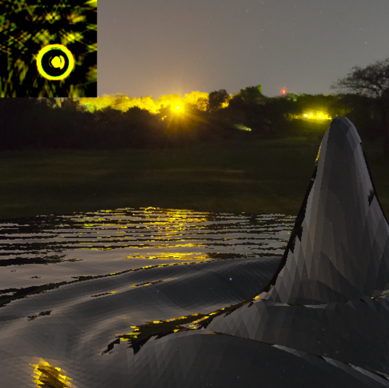

# 勾配命令
勾配命令を使って、頂点毎に動かしたメッシュの法線を使ってシェーディングします。

https://webglstudy.github.io/14_ddx/

# 課題
次の問題に挑戦してみてください。

- いろいろな変数の勾配を計算してみよう。

# 課題の進め方
次のように課題を解いてみてください。

- プロジェクトをforkします
- GitHub Pages の機能を使って、ホームページを立ち上げます
- 問題を解きます
- GitHub Pages で正答したか確認しましょう

# 謝辞
今回のリポジトリでは次のアセットを使わせていただいています。

- Greg Zaal 氏の Moonless Golf の画像
  - https://hdrihaven.com/hdri/?h=moonless_golf
- Enki Mute 氏の hdrpng.js
  - https://enkimute.github.io/hdrpng.js/
- wgld.org の minMatrix.js
  - https://wgld.org/d/library/l001.html
